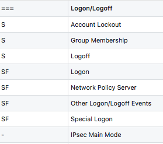
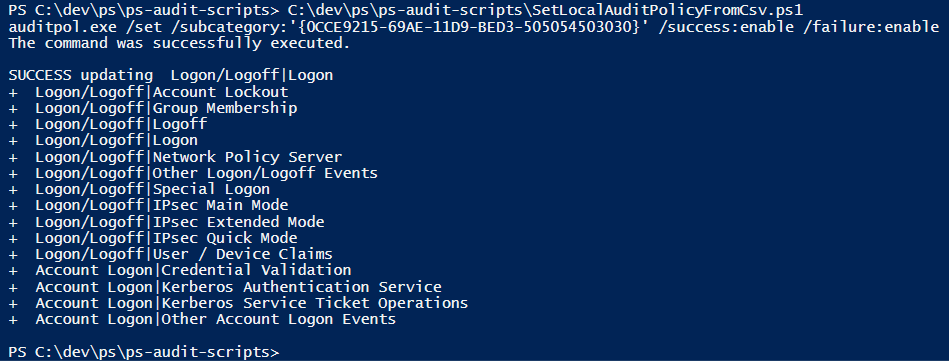

# ps-audit-scripts
Powershell scripts for setting local event log audit settings using auditpol.exe

Loads system-audit-settings.csv from local directory and if current local settings differ from desired settings, will set them accordingly, writing status to stdout.

# CSV format
The simple CSV file has two columns: settings flags and subcategory name.  Flag 'S' indicates success should be enabled, while 'F' indicates that failure should be enabled.  Everything else is ignored, and '-' is a placeholder to indicate No-Auditing.  A special category name row contains '===' in the first column.

The third row in the screenshot below indicates that the audit settings for Category 'Logon/Logoff', SubCategory 'Group Membership' should be success:enable failure:disable

# Example
The screenshot below is an example where a single setting doesn't match.

# References
[Event Log Cheatsheets](https://www.malwarearchaeology.com/cheat-sheets/)
